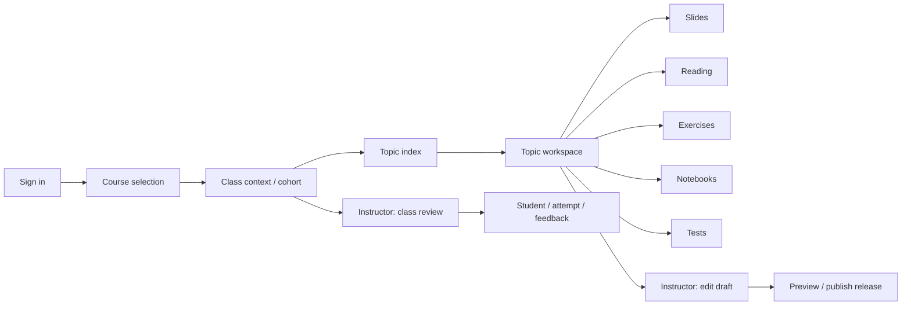
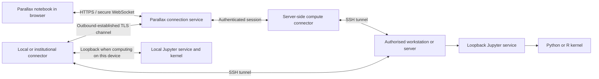
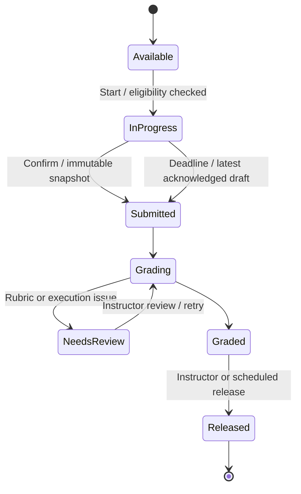
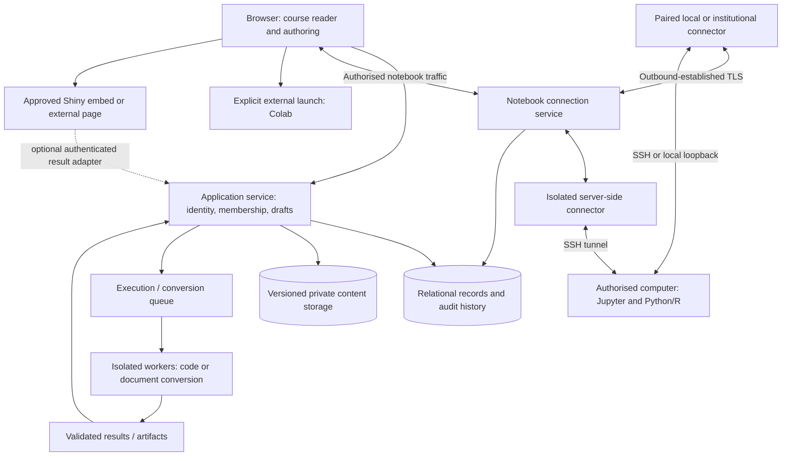

# Parallax — product specification

**Status:** unified design; notebook connection requirements updated 29 September 2026. Fable’s review and counterproposal are resolved in [the decision record](design-reconciliation.md). This document is the canonical product specification; the accompanying [wireframe](wireframe.html) is a visual demonstration. Names, student records, and course material in it are fictional.

## 1. Product and design decisions

A student opens a course, chooses a topic, and studies in five horizontal tabs: **Slides, Reading, Exercises, Notebooks, Tests**. The topic and place within each resource survive tab changes. An instructor uses the same content views, with editing controls and a separate class review area for student work.

The central surface belongs to the material. A slide occupies the available stage. A reading uses a comfortable text measure with an optional annotation margin. A notebook reads as a continuous document. Shiny and code exercises receive working space rather than small embedded previews.

Use white content surfaces, neutral-grey navigation, charcoal controls, and sans-serif type throughout. A softly shaded syllabus row identifies the current topic; a thin underline identifies the current resource tab. Keep the lesson close to its controls and make the note editor visibly editable. Avoid tan surfaces, decorative gradients, oversized greetings, motivational badges, and dashboard statistics above the lesson.

The following decisions are assumptions to review, not unresolved requirements hidden in the design:

| Decision | Proposed default |
| --- | --- |
| Audience | University and independent courses; first examples use computational statistics. |
| Course versus class | A course contains reusable material. A class is a cohort taking a pinned release of that course. |
| Access | Invitation or enrolment code for a class. Public course browsing can be added later. |
| Identity | One account; student or instructor permissions are assigned per class. Separate sign-in entry points express intent, not entitlement. |
| Personal work | Notes, highlights, and drawings are private until explicitly shared. Instructors see assigned work, results, comments, and questions shared with them. |
| Computing | Notebook cells can execute on an authorised local computer or server through an SSH-backed connection. Python/R kernels run on that machine; Parallax provides the notebook interface. The connector architecture in §10 is the proposed implementation. Colab and Shiny remain additional modes. |
| Assessment | Untimed by default. Timers, retakes, release dates, and late policies are explicit class settings. |
| First deployment | One teaching organisation. Class isolation is required from the start. Billing and institution-wide administration are outside this brief. |

## 2. Information structure



**Course:** title, description, authors, ordered topics, published releases. **Class:** course release, cohort name, instructors, students, calendar, assignment settings, accommodations, results. **Topic:** title, learning objectives, order, optional prerequisites, resources in the five tab categories.

A user enrolled in one class of a course goes straight from that course to its topic index. Multiple enrolments show a class chooser after the course card. Keep the cohort name visible in the topic heading and instructor review so a teacher cannot accidentally grade the wrong class.

Suggested navigable addresses:

| Destination | Address contract |
| --- | --- |
| Enrolled courses | `/courses` |
| Topic index | `/classes/:classId/topics` |
| Topic resource | `/classes/:classId/topics/:topicId/:tab?resource=:resourceId` |
| Anchored discussion | Resource address plus stable annotation or thread identifier |
| Student attempt | `/classes/:classId/review/students/:studentId/attempts/:attemptId` |
| Course draft | `/courses/:courseId/edit/:topicId` |

Browser Back restores the previous resource, position, and open margin. A copied link opens the referenced resource only after checking enrolment and visibility. A link to unpublished material explains that it is unavailable; it must not disclose its title or contents to an unauthorised visitor.

## 3. Sign-in and permissions

The entry page offers **Student sign in** and **Instructor sign in**. Both use the same identity service and accept the same account. The student entrance opens **Your courses**, scoped to enrolled classes, with a saved-resource Resume action. The instructor entrance opens **Courses you teach**, scoped to teaching memberships, with Class review and permitted authoring actions. A person holding both roles can switch between those authorised contexts. Both can use `/courses` with an explicit view; the distinction is its content and actions, not a second account. A student who chooses the instructor entry sees an access explanation and their enrolled classes, without gaining instructor privileges.

Email sign-in links are the proposed initial method. Preserve the intended destination through authentication, use expiring single-use links, support sign-out, and require authentication again for sensitive membership changes. Institutional sign-in is a later provider decision.

| Capability | Student | Class instructor | Course owner / delegated publisher |
| --- | --- | --- | --- |
| Open released class material | Yes | Yes | Only through an authorised class or course preview |
| Save personal annotations | Own | Own | Own |
| Connect a personal computer / SSH account | Own connections | Own connections | Own connections |
| Read another student’s private notes | No | No | No |
| Read class-visible discussions | Same class | Same class | Only with class access |
| Read instructor-visible questions | Own threads | Assigned classes | Only with class access |
| View submissions and exercise attempts | Own | Assigned classes | Only with class access |
| Grade and return feedback | No | Assigned classes | Only with class access |
| Edit course content | No | Assigned course drafts | Yes |
| Publish shared course releases | No | If delegated | Yes |
| Adopt a release / set class deadlines | No | Assigned classes | If also class instructor |
| Invite instructors / manage enrolment | No | If explicitly delegated | For owned courses and classes |

Course owner and publisher are permissions held by instructors, not a third sign-in persona. New courses grant their creator these permissions. Only an owner or an instructor with a membership-management grant may issue an instructor invitation; a student enrolment code never grants instructor access. Inviting a class instructor grants draft editing for its course and review access for that class; publication and membership management are separate grants. Every content read, media download, result export, and background job checks the relevant course or class scope on the server.

**Preview as student** shows the class’s release rules and layout using a separate preview identity. Preview attempts cannot change a real student’s record. The wireframe’s role selector demonstrates these views only.

## 4. Course and topic selection

### Course selection

Follow the course grid in [the supplied reference](idea_draft.png). Each card contains one small subject mark, title, topic count, term, and a two-pixel progress line. Show a specific resume location and a visible reviewed count, such as “2 of 5 reviewed”, on each active student course card. Place Resume within that card, beside or below the count, rather than under the whole grid. The card opens the topic index; a separate **Resume** action opens the saved resource. Use three columns on desktop, two on a compact screen, and one on a phone. The instructor catalog replaces personal study progress with class context and **Class review**, and offers **Create course**. Membership settings require their separate grant.

An empty student account shows **Join a class** with an invitation/code field. An expired or full class invite shows its cause and a route back to course selection. Provide **All**, **In progress**, and **Archived** filters, plus title search. Archived classes retain permitted read access. Course progress counts reviewed topics against the declared course completion rule; do not imply it is a grade. Provide the reviewed count as accessible text, not only a line length.

### Topic index

Use a compact syllabus table with topic number, title, resource availability, estimated study time, and status. Five narrow columns represent Slides, Reading, Exercises, Notebooks, and Tests. Filled and empty markers indicate available and absent content; provide full accessible labels and a visible letter legend. The current topic has a soft-grey row and a **Resume** action. The workspace heading carries a one-line learning objective immediately beneath the topic title, followed by course, topic position, study time, cohort, and instructor. The syllabus keeps one Resume action on the current row; its footer carries the resource legend and reviewed count. Select a topic to open its saved tab; on a first visit use Slides when available, otherwise the first populated tab. Return to this table through **Topics** in the global bar.

Topics can be available, scheduled, prerequisite-locked, or complete. A locked topic shows the release date or unmet requirement. Completion is defined by the course author, displayed to students, and distinct from a passing grade. Reading or viewing a slide never silently proves understanding. Students can mark ungraded material as reviewed; graded requirements derive from submissions.

## 5. Topic workspace and dimensions

The composition follows [idea_draft.png](idea_draft.png): one full-width topic, a single horizontal tab row, and a large material stage. Topic navigation lives in the syllabus table rather than a permanent sidebar. The reference guides layout; its runtime labels and example course data are not claims about implemented services.

### Desktop reference: 1440 × 900 CSS pixels

| Region | Size and behaviour |
| --- | --- |
| Global bar | 56 px minimum. Parallax, Courses, Topics, and previous/next topic. Course and cohort context are in the topic heading. The wireframe role selector is in its demo footer, outside product navigation. |
| Topic heading | Approximately 120 px high with title, one-line objective, course, topic position, study time, cohort, and instructor. Grows when text wraps. |
| Tab row | 44 px high; content-width labels, 32 px gaps, a 2 px active underline. |
| Resource toolbar | At least 44 px high. Resource title or picker, local tools, Full screen, and Focus. |
| Main stage | Full available width, capped at 1600 px. Horizontal inset 40 px on desktop, 32 px on compact desktop, 16 px on phones. |
| Reading measure | Normally 640–720 px; body 18 px / 30 px. Centre the combined reading and notes area within a maximum 1080 px width. |
| Annotation margin | 280 px wide with a 56 px gap. Align a selected note beside its source passage; collapse on request. The wireframe measures its selected passage after layout and resize; no fixed offset stands in for anchoring. On a narrow screen, the note follows the reading in document flow. |
| Slides | Preserve the source ratio; use neutral-grey letterboxing only in unused stage space. The supplied desktop wireframe displays a 16:9 slide at roughly 978 × 550 px normally and 1316 × 740 px in Focus with notes closed. Opening slide notes allocates a 280 px column and refits the slide; the exact stage dimensions depend on available viewport space and wrapped controls. |
| Slide controls | A 2 px position line above the left-aligned Previous / page count / Next group. Slide index and Notes open on demand. Full screen and Focus remain in the local toolbar. |
| Notebook / Shiny | Continuous full-width material. The notebook container may use 1160 px; prose stays measure-limited. Shiny receives the remaining viewport height. |
| Assessment | At wide widths, approximately 43% prompt and 57% editor/output with a 48 px gap and a quiet divider. Stack when the editor cannot retain a useful measure. |

The four chrome regions use about 264 px before stage padding. These are minimums and reference dimensions, not fixed heights that clip enlarged text. The demonstration footer is outside the proposed product and does not reserve space in a production viewer.

```text
┌────────────────────── Global bar · 56 ──────────────────────────┐
│ Topic title + objective + course / class · about 120          │
├────────────────────────────────────────────────────────────────┤
│ Slides   Reading   Exercises   Notebooks   Tests · 44            │
├────────────────────────────────────────────────────────────────┤
│ Resource picker / local tools / Full screen / Focus · 44         │
├───────────────────────────────────────────┬────────────────────┤
│                                           │ Optional notes     │
│            Full-width material            │ 280 + gap 56       │
│                                           │ beside the anchor  │
└───────────────────────────────────────────┴────────────────────┘
```

Keep all five tabs in the same order. An empty category opens a small “No reading has been added” state for students; instructors get **Add reading**. Multiple resources of one kind use the toolbar picker with meaningful titles. Text weight, an underline, and `aria-selected` identify the active tab. Provide tab/panel relationships and arrow-key navigation. Each tab restores its own resource, position, and draft work.

### Focus and full screen

**Focus** hides the global bar, topic heading, and tabs while retaining the resource toolbar and **Exit focus**. **Full screen** or **F** requests browser full screen and expands the material. Ignore F inside editable fields and when modifier keys are held. If full screen is unavailable, retain the expanded Focus layout and explain the fallback. Escape exits browser full screen and restores the normal workspace; in Focus alone, Escape also restores it. Preserve the current slide and edits throughout. Keep both controls: Focus preserves the browser’s tabs and address bar; Full screen uses the browser display mode. While full screen is active its control becomes **Exit full screen**. Exit focus also leaves full screen if necessary. When full screen is denied, Escape or Exit focus closes the fallback.

Reading retains its measure. Slides fit the enlarged stage; notebooks and Shiny use its width and height. A slide index opens on demand instead of occupying a permanent thumbnail panel.

### Smaller screens

At 801–1199 px, use 32 px side padding, a 260 px notes column, and a 32 px reading gap. At 800 px and below, stack notes and split editors below the main content. Course cards become two columns, then one at 540 px. At phone widths use 16 px side padding. Topics always opens the syllabus; there is no sidebar to collapse.

Previous/next topic controls wrap below the left navigation group on smaller screens; unavailable topics report their release condition. The production tab strip scrolls horizontally with a continuation cue; the wireframe wraps labels so the entire mockup remains inspectable in a conversation. Notes may open as a bottom sheet in the implemented application; the wireframe keeps them in document flow. Confine necessary horizontal scrolling to the syllabus table, wide data tables, and code regions. Embedded tools retain an external-open route and a keyboard-friendly plain-text code editor fallback.

## 6. Visual system

| Token | Light | Dark | Use |
| --- | --- | --- | --- |
| Workspace | `#FFFFFF` | `#15171A` | Main content background |
| Sheet | `#FFFFFF` | `#1B1E23` | Menus, inputs, and slide surface |
| Secondary surface | `#F6F7F8` | `#1B1E23` | Table headings and code blocks |
| Ink | `#202124` | `#EEF0F3` | Body, headings, active navigation |
| Secondary ink | `#60646C` | `#AFB5BF` | Dates, captions, secondary controls |
| Rule | `#D9DCE1` | `#3B4048` | Structural dividers |
| Primary control | `#202124` | `#EEF0F3` | Filled actions and annotation tools; inverse text `#FFFFFF` / `#202124` |
| Soft surface | `#F1F2F4` | `#292D34` | Selected tool, note excerpt, plot fill |
| Highlight | `#F7EDB1` | `#534A20` | Marked passage only; all page grounds remain neutral |
| Success | `#315747` | `#A9CEBC` | Saved/passed states with a text label |

Check contrast against the actual rendered surface: at least 4.5:1 for normal text and 3:1 for large text and essential control boundaries. The light rule is decorative; input boundaries and focus rings use a stronger colour. Error and success messages include text and icons or labels.

Keep Workspace and Sheet as separate semantic roles: both are white in the light theme, while the dark theme distinguishes the canvas from fields and slide sheets. Primary control is an alias of Ink, not a separately maintained colour. Use one title token for the 28 px headings.

Use one sans-serif family for headings, reading, and controls. The wireframe uses Segoe UI with Arial and Helvetica fallbacks and needs no font download. Use a monospace face for code with a 16 px minimum editable size. Mathematical notation may use a serif face; it is not the heading style.

Type targets: page/topic/reading titles 28/35; course-card titles 18/24; body 18/30; UI 14/20; metadata 12/18. Allow user font scaling. Use 32 px between desktop tabs, 40 px stage side padding, and 56 px between reading and notes. Course cards have 8 px corners, note blocks 6 px, and ordinary controls 4 px; primary actions and exercise options use rounded ends as in the reference. On touch/coarse-pointer devices, actionable targets are at least 44 × 44 px; fine-pointer controls may be compact. Inline text anchors retain text-selection behaviour and also have a full-size Note action. Keep motion limited to changes of state and respect reduced motion. [DESIGN.md](../DESIGN.md) records the wireframe's reusable visual decisions.

## 7. Slides

Accept PDF decks and instructor-authored web slides. A presentation file may be attached for download, but it must be converted to a supported viewing format before publication. Keep selectable text or an accessible transcript and meaningful alternatives for diagrams. A raster-only deck requires a text alternative.

The viewer offers previous/next, page number, jump-to-slide, fit, zoom, Focus, Full screen, and an optional notes/questions margin anchored to a slide. Left/right keys change slides only when the viewer owns keyboard focus; they never hijack typing. Keep focus on the viewer after each change so repeated arrow presses work. The wireframe shows a four-item jump index and per-slide private notes and audience-labelled discussion. Changing slides changes the note context without overwriting the previous slide’s draft. Fit shows the whole slide without distortion. Zoom may pan within the stage and has a clear return-to-fit command.

Remember the last slide for each student and deck revision. Replacing a deck preserves old annotations against its old revision until the instructor maps them. Loading one page must not require downloading every full-resolution page. Provide retry and original-file download when authorised if conversion or rendering fails.

## 8. Reading, notes, highlights, drawings, comments, and questions

Support native HTML/Markdown readings and PDFs. Native readings render headings, equations, figures, citations, and code. PDFs have fit-width/page controls, selectable text when available, and a page indicator. Students can switch between multiple readings without losing their place.

Selecting text opens **Highlight**, **Note**, and **Ask**. Ask is the single discussion composer for comments and questions; no separate Comment action duplicates it. Highlight uses pale yellow by default with an optional small palette. Keep the compact selection toolbar adjacent to its passage without covering surrounding text; selecting a note moves focus to the corresponding editor. The wireframe exposes these actions for one pre-marked passage rather than implementing arbitrary text-range annotations. Note creates a private annotation. Ask opens an audience choice: **Instructor** or **Class**. Audience is visible before posting and on every saved thread, and is preserved with an unsent draft across tab and margin changes. Changing a private note into shared content is an explicit action; it never happens when the margin opens.

The margin has **My notes** and **Discussion**. Selecting an entry scrolls to and marks its anchor. Selecting a mark opens the corresponding entry. Multiple marks at one location show a count. General topic notes may exist without a text anchor. Discussion supports replies, edited indicators, instructor responses, and Open/Resolved status; students may reopen their own question. A student sees only threads permitted by the audience rule.

A **Sketch** action belongs on a figure or PDF page, not on the text-selection toolbar. Freehand tools include pen, colour, stroke width, eraser, undo/redo, and **Done**. Pen input supports stylus and touch without converting normal scrolling into ink. Drawings on PDFs store page-relative coordinates; drawings on native readings attach to a figure or a bounded sketch area. Do not paint on unstable paragraph coordinates that will move when text reflows. Provide a text description field and a non-drawing way to submit the same explanation.

Annotation records include resource revision, author, audience, anchor, body or strokes, and timestamps. Native text anchors use block identifiers plus quote and surrounding context; PDF anchors use page index and normalised coordinates, with a text quote when available. Reflow, zoom, and Focus must not detach marks. When a new revision cannot be mapped confidently, retain the original quote and mark **Needs reattachment** rather than guessing.

Autosave private changes after about one second of inactivity and on blur. Show **Saving**, **Saved**, **Offline · changes on this device**, or **Could not save · Retry** beside the editing surface. A successful local write is not a server acknowledgement. A pending save remains pending across rerenders and tab changes. The wireframe simulates the one-second transition in memory, explicitly identified in its footer; it does not persist a note. Preserve unsent drafts on a permitted local store and reconcile after reconnect; clear account-specific local material on sign-out. Concurrent edits show a conflict recovery view rather than silently overwriting a longer draft.

Private annotation export includes text, resource title, source reference, and readable drawings. Sharing an annotation shares only the selected annotation and quoted context. Instructors can moderate class discussions with an audit record; students can edit/delete their own posts according to the class’s declared policy. A deleted parent retains a tombstone when replies depend on it.

## 9. Interactive exercises

An exercise is a short sequence of predictions, manipulations, and explanations. The reference exercise asks the learner to predict how increasing sample size changes the spread of sample means, adjust a control, then explain the result. The wireframe separates this into **Predict → Inspect → Explain**, with one active step and a labelled three-segment track. Predict advances after a correct check or an explicit solution reveal. Inspect advances after comparing n = 100 with the baseline n = 25. Explain requires non-whitespace text; saving it means the practice is complete, not that an automatic grader has judged its reasoning.

Support numeric answers with tolerances, single/multiple choice, labelled ordering or matching, graph manipulation with keyboard equivalents, short explanations, and code tasks. Every step has a prompt, response schema, validation rule, feedback, optional hints, and completion rule. Authors define which observations a simulation should expose; avoid recording every pointer movement.

**Check answer** records the response and returns targeted feedback. Wrong answers retain the work and allow another attempt. Hints appear in sequence and their use is recorded. **Show solution** is a separate event and marks the step as completed with help. A completed exercise records whether it was solved independently, with hints, or by revealing the solution; none of these should be collapsed into an unexplained percentage. Hint-use and solution-reveal events are permanent within an attempt, independent of whether a disclosure is currently visible. Starting again creates a new practice attempt and retains the preceding attempt’s evidence.

Practice is ungraded by default. If assigned for credit, show the points and hint/attempt policy before starting. Instructor review includes final answers, checked attempts, hints used, and relevant simulation parameters. Resetting a simulation does not erase already recorded attempts. Use seeded randomness where replay is needed, and version the exercise definition so the instructor sees what the student saw.

## 10. Notebooks and computing

### 10.1. What a notebook connection means

A student or instructor can open a notebook in Parallax and **run its cells on a computer they are authorised to use**: their own laptop or desktop, a laboratory workstation, or a remote server accepting SSH connections. The notebook stays in the full-width Parallax workspace. Its Python or R process runs on the selected computer, using that computer’s installed packages, files, CPU, memory, and available GPU. A remote server does not need to host the Parallax website.

Three things remain distinct: the **notebook document** contains code, text, and saved outputs; the **connection** provides access to a machine; the **kernel** is the Python/R process holding live variables. Saving the document does not save the process’s memory. An SSH login by itself is insufficient: the target also needs a compatible notebook runtime, permission to start or attach to it, and an allowed network path.

SSH-backed notebook execution is part of the first complete release. It replaces the earlier assumption that all connected notebook computation could wait for a later extension. Automatically provisioning Parallax-owned compute remains optional. The design below specifies a proposed connector architecture; no connection has been implemented in the wireframe.

The resource picker contains notebook titles. Beside it, show the actual mode and target, for example **Saved outputs**, **Lab workstation · Python · Ready**, or **Research server · R · Running**. Display Connected/Ready only after checking the notebook service and selected kernel, not merely after SSH authentication.

| Mode | Student experience | Recorded by Parallax |
| --- | --- | --- |
| Rendered Jupyter notebook | Continuous text, equations, source cells, tables, figures, and stored outputs. Collapse source/output independently; outline and Focus available. | Resource position and any platform annotations. No implied execution. |
| Connected notebook: personal or local computer | Connect a laptop, desktop, or workstation; select an installed Python/R kernel; edit and execute cells within Parallax. A local connector supplies access when the machine is on a private network. | Personal notebook revisions, acknowledged outputs, connection/session identity, and explicit submissions. |
| Connected notebook: SSH server | Use an authorised SSH account, optionally through a jump host, to start or attach to a notebook runtime. The same cell controls work against the remote machine. | The same notebook/session records, plus a non-secret host and environment reference. |
| Open in Colab | Explicit external launch; instructions to make a working copy; return via an uploaded `.ipynb` or declared assignment submission. | Launch event if useful, plus the submitted snapshot. No automatic grade or runtime sync. |
| R Shiny app | Large embedded app with title, connection state, Focus, Full screen, restart, and Open externally. | No learning result unless the app implements an approved result-return contract. |

### 10.2. Connection paths

The browser communicates with Parallax over HTTPS and secure WebSockets. An authorised **compute connector** handles SSH, runtime startup, and the tunnel to the notebook service. A connector can run on the learner’s machine, inside the institution’s network, or in an isolated service operated alongside Parallax. It is a separate component to build and distribute, not an assumed browser feature.

| Target | Required path |
| --- | --- |
| Computer reachable by an approved Parallax connector | The connector connects to that host’s SSH service using the user’s credentials. “Local computer” may mean a lab or LAN machine; it is not automatically reachable from the website. |
| Computer behind a home router, campus firewall, or VPN | A connector on that computer or an authorised machine in the same network establishes an outbound authenticated TLS connection to Parallax. It then uses SSH to reach the target through the network/VPN available to it. No public SSH port or router forwarding is required for this path. |
| The same computer on which the connector runs | The connector can start a local Jupyter service directly. This avoids requiring an SSH server just to access the same machine; SSH remains available for reaching other computers. |
| Server reached through a bastion/jump host | The selected connector follows a configured SSH jump-host route, verifying each host. If the institution requires VPN access, the connector must run where that VPN route exists. |



The target’s Jupyter service listens on loopback and remains authenticated. SSH forwards that service to the connector; Parallax relays only the authorised notebook session, not an unrestricted TCP proxy. The target does not need a publicly exposed Jupyter port. Host verification, local forwarding, and jump-host configuration use standard SSH mechanisms. [OpenSSH connection configuration](https://man.openbsd.org/ssh_config).

A target must permit the required process launch and port forwarding. Where these are prohibited, show the specific restriction and retain download/external-open options. Access to an HPC login node does not authorise computation there: connect to an allocated compute node or use an institution-approved scheduler adapter. Automatic scheduler submission is a separate integration, not inferred from successful SSH login.

### 10.3. Set up and connect

From a notebook, **Connect computer** opens a connection panel. Its first choices are **This computer**, **SSH host**, and any **Class computers** published by the instructor. The panel collects:

| Field | Contract |
| --- | --- |
| Connection name | A recognisable label such as “My laptop” or “Lab GPU server”. |
| Connector | The device or managed connector through which the target is reachable. A newly installed local connector is paired to the user’s account with a short-lived code and explicit device approval. |
| SSH target | Hostname/IP, port (default 22), username, and optional jump host. These are unnecessary for direct execution on the connector’s own computer. |
| Authentication | Reference to an SSH key, SSH agent identity, or certificate. With a local connector, keys and passphrases stay in that connector/OS credential store. A managed connector uses an explicitly configured credential in its encrypted secret store. Interactive authentication/MFA is completed through the connector’s supported flow; an unsupported method is reported before launch. |
| Host identity | Previously trusted fingerprint or an explicit first-use verification. A changed host key blocks reconnection until the identity is checked and deliberately updated. |
| Workspace | An authorised working directory for this user and class. Show the exact destination before copying course files. |
| Runtime | Start a compatible Jupyter service using a configured environment, or attach to an existing authorised service. Discover available kernels and let the learner choose Python/R and its environment. |

**Test connection** checks reachability, host identity, SSH authentication, directory access, forwarding, notebook authentication, and available kernels. Report each failing stage separately. If the notebook service is not running yet, test runtime availability and report **Ready to start**, reserving the live service/kernel checks for Connect. Testing may probe capabilities but does not install packages, execute notebook cells, or replace files.

**Connect** shows the selected host, account, workspace, and whether it will start a service or attach to one. It creates or resumes the learner’s working copy, establishes the service connection, and starts or reattaches the chosen kernel. Opening the notebook never runs its cells automatically. A missing runtime or package produces setup instructions; environment installation is a separate explicit action, with no assumed administrator access.

An instructor can publish host/environment templates for a class, provided the host owner permits this use. Each learner receives their own OS account or an isolated session issued by the host’s allocation service. Sharing a template never shares an instructor’s SSH key, home directory, or live kernel. Course membership alone does not grant machine access; instructors cannot inspect or operate personal connections merely because they teach the class.

### 10.4. Running cells and controlling a session

Keep notebook cells, outputs, and errors in the existing continuous layout. The compact toolbar carries the target and kernel state, **Run cell**, **Run all**, **Interrupt**, and a session menu with **Restart kernel**, **Disconnect**, and **Stop session**. Connection settings open in a panel; they do not permanently consume notebook width. Show CPU/GPU or memory availability only when reported by the selected environment, not from an assumed machine specification.

The implementation uses Jupyter’s session/kernel APIs for lifecycle operations and its kernel WebSocket protocol for execution and output. Associate each execution request with the notebook revision, cell ID, code hash, kernel ID, and request/message ID so late output cannot attach to a different cell or restarted kernel. [Jupyter Server API](https://jupyter-server.readthedocs.io/en/latest/developers/rest-api.html), [kernel WebSocket protocol](https://jupyter-server.readthedocs.io/en/stable/developers/websocket-protocols.html).

| Action or state | Required behaviour |
| --- | --- |
| Ready / Running / Waiting for input | Reflect the actual kernel. Render streamed output incrementally and label truncated output; input prompts belong to their executing cell. |
| Run cell / Run all | Send an explicit execution request. Run all uses notebook order and stops on an error by default. A transport failure must not automatically replay a request that may already have executed. |
| Interrupt | Ask the running kernel to stop its current operation. If it does not respond, offer Restart with a warning that variables will be lost. |
| Restart kernel | Start fresh process state after confirmation. Keep the notebook document and mark existing outputs as belonging to the previous kernel session. Do not run cells again automatically. |
| Disconnect / close tab | Detach the interface without claiming the kernel stopped. An owned session may continue under the host’s published idle/disconnection policy. Show that policy before connection. |
| Connection lost | Disable new execution; keep editing and acknowledged outputs available. Show the last known kernel state as unconfirmed. Never label disconnected work completed merely because the connection closed. |
| Reconnect | Reauthenticate and query the recorded session/kernel. Reattach if it still exists; if it was stopped, offer a new kernel and explain that variables are gone. Do not silently rerun cells. |
| Output missed during disconnection | Restore only output actually retained by the connector/runtime. When complete recovery is unavailable, mark that execution’s result unknown or incomplete and let the learner decide whether to rerun it. |
| Stop session | Stop the session owned by this connection, confirm shutdown, and close its tunnel. For a runtime merely attached from outside Parallax, detach by default; stopping it requires ownership and an explicit action. Never stop unrelated processes on the host. |

A heartbeat lease governs sessions started by a managed connector. Its grace period and idle timeout are visible and enforced by the connector, including when the browser disappears. Personal/external services may have different shutdown policies. A sleeping laptop, lost VPN, SSH timeout, stopped service, or expired allocation must appear as a distinct cause. Long-running durable jobs require a host-supported job facility; an interactive notebook session does not promise that capability.

### 10.5. Files, saving, and submission

The course notebook is an immutable teaching resource. First use creates a private working copy tied to its resource revision. Parallax stores this notebook’s acknowledged edits and outputs; the selected machine supplies the process and working filesystem. Before first execution, copy only the declared notebook/data files into the chosen workspace. Never synchronise the learner’s entire home directory.

Keep storage destinations explicit: **Saved to Parallax** means the platform acknowledged a document revision; **Save to computer** exports that revision as `.ipynb` into the selected workspace. Output files created by code remain on that computer until the learner selects them for download or upload. Remote file access is limited by the remote account; the workspace picker is a convenience boundary, not a sandbox around executing code.

File transfer compares revisions/checksums and asks how to resolve an existing divergent file rather than overwriting it. Importing a remotely edited notebook creates a new working-copy revision. Kernel variables, unselected datasets, credentials, and unrelated files are not included in a save or export. Remote disks and temporary allocations may be deleted under the host’s policy; Parallax keeps only copies it has actually received.

**Submit notebook** freezes the chosen `.ipynb` revision and explicitly selected supporting files after upload acknowledgement. Record the source-resource revision and available environment metadata. Instructor review shows this submitted snapshot, not access to the learner’s machine. Outputs produced on a learner-controlled host are not trusted grades. Assessments needing verified execution run the submitted code in the isolated grading service in §11, with hidden checks kept off the learner’s computer.

### 10.6. Access and isolation

Authorise every connection, notebook API call, WebSocket, and file transfer against the user and session. Raw SSH credentials and notebook-service tokens must not appear in notebook documents, page URLs, browser storage, exports, or logs. Personal SSH agent use stays at the connector; do not forward the agent to the target by default. Revoke the connector’s Parallax access when it is unpaired or its account is revoked, without pretending that this revokes the person’s independent SSH account.

The server-side connector operates in a separate network/credential boundary from the application. Permit only authorised target/port combinations and configured jump routes; prevent user-supplied destinations from reaching application databases, cloud metadata endpoints, or unrelated internal services. Private/LAN addresses are allowed only through the connector’s explicitly approved network scope. Bind the intended target after resolution and validate forwarding destinations as well as the initial SSH endpoint.

Notebook access permits code execution with the remote account’s privileges. A shared Jupyter token or notebook directory is not student isolation. Hosts used by multiple students must enforce account/container and resource separation themselves; a personal connection may have broader access to that person’s files, which the connection screen must state. The host controls CPU, memory, GPU, disk, package, and network limits; report its restrictions without claiming Parallax imposes the Tests sandbox on a personal machine. Jupyter authentication and authorisation are distinct controls, and kernel access is a powerful capability. [Jupyter Server security model](https://jupyter-server.readthedocs.io/en/latest/operators/security.html).

### 10.7. Rendering, Colab, and Shiny

Jupyter rendering supports Markdown and code cells, execution counts, common image/text/HTML MIME outputs, and readable errors. Prefer safe static output when rich output is unsupported. Never run a notebook on upload or execute arbitrary JavaScript from stored output. Keep the source download accessible when sanitisation removes interactive output. The [Jupyter notebook format](https://nbformat.readthedocs.io/en/latest/format_description.html) defines cell types and MIME output bundles; that is the import contract.

Colab stores and shares notebooks separately from the runtime VM; sharing a notebook does not share the VM or its installed files. Its compute availability and session limits are variable. Therefore the proposed integration is an external workspace with an explicit submission boundary, not a guaranteed compute dependency for tests. Include environment/setup cells and required data with each notebook. [Google Colab FAQ](https://research.google.com/colaboratory/intl/en-GB/faq.html).

For Shiny, configure an approved origin and test embedding, authentication, cookies, and available space for the actual host. Posit’s embedding documentation describes iframe use and authentication behaviour; successful access in a top-level tab does not establish that embedding will work for every deployment. Always provide the external route. A wireframe or disconnected fixture must say Preview / no R session, never Connected. A production connection label requires a verified live session. [Posit Connect embedding documentation](https://docs.posit.co/connect/user/embedding-content/).

A graded Shiny task must return a server-verifiable artifact or result through an authenticated adapter tied to class, student, assignment, version, and attempt. Browser messages from an arbitrary iframe are not grades. An origin-validated message may report readiness or resize; it cannot on its own certify a score. If no adapter exists, require a written answer or uploaded artifact that the instructor grades.

Colab is an additional external route, not the SSH connector. Shiny is an application process, not a notebook kernel. A compatible Shiny host may use an approved tunnel/proxy arrangement, but embedding, authentication, and result return still follow its separate contract above; connecting a Python/R kernel does not connect a Shiny app.

The first complete release includes rendered notebooks, connected execution on authorised personal/local computers and SSH servers, the external Colab workflow, and embedded/external Shiny. A Parallax-provisioned compute pool and automatic HPC scheduler integrations remain extensions. The secure execution service for Tests is required independently of notebook connections.

## 11. Tests, including code implementation

### Assignment and start

A test may mix quizzes, numeric answers, explanations, and code implementation. Before starting, display allowed attempts, grading rule, points, opening/closing times with time zone, any duration, allowed materials, late policy, and when results/solutions will be released. Keep effective assignment terms visible in the prompt column during work, rather than only in a dismissible notice. Defaults: one attempt, untimed, no late submission, manual release of results. Class settings can override these defaults before release.

Class instructors can grant an individual extension or extra attempt with a reason. Students see their effective settings. The server determines eligibility and time remaining; a browser clock never decides whether a submission is late. A timed deadline is the earlier of the class close and the student’s start plus adjusted duration, unless an explicit extension changes it.

### Working and running code

Show question navigation with Answered / Unanswered / Flagged labels, the prompt, and a working area. Code tasks include language/version, starter files, allowed packages, input/output contract, resource limits, and sample tests. The editor supports indentation, line numbers, keyboard navigation, a screen-reader mode, and a downloadable draft. Keep output below the editor or in an adjustable pane; long logs must not push the prompt out of reach.

**Run sample tests** evaluates a saved code snapshot and labels its result with that snapshot. Editing afterwards marks the output as out of date. Show compile/runtime errors, expected/actual output for public cases, timeout, and resource exhaustion distinctly. Running sample tests does not submit the assessment. Hidden tests and solution code never reach the browser before the release policy permits them.

Execute student code in a disposable isolated worker, separate from the application and its database credentials. Disable external networking by default, restrict filesystem and processes, cap CPU, memory, wall time, output size, and concurrent runs, and destroy the environment after the job. Proposed teaching defaults: 10 seconds wall time, 512 MiB memory, 1 MiB captured output, two active runs per student, and approved versioned Python/R images. Course-specific changes need server-enforced upper bounds. File uploads and package installation cannot escape those limits.

An execution record binds the student, attempt, question revision, code hash, runtime image, grader version, and job identifier. An infrastructure failure produces **Run unavailable · Retry** and consumes no attempt. Queued/running/cancelled/time-limited/failed/passed are separate states. Instructors can replay an immutable submission against the same grading version; regrading creates a new result with a reason.

### Save, submit, grade, release

Autosave answers and code while showing acknowledgement state. On **Review submission**, list unanswered questions, any unsaved changes, and the effective deadline. **Submit test** freezes an immutable attempt and returns a receipt with timestamp and attempt ID. Use an idempotency key so a repeated click or reconnect cannot create a second submission. A receipt is shown only after server acknowledgement.

When timed work expires, the server submits the latest acknowledged draft and marks it auto-submitted. If unsent local changes remain, tell the student exactly what was received and preserve the local copy for an instructor recovery request. A network failure must not produce a fictitious success state. Before expiry, reconnect fetches the server state before resuming.



Retakes create a new attempt and preserve earlier ones. The assignment specifies latest, highest, or instructor-selected attempt as the reported grade. Manual rubric points, automated results, overrides, and release history remain distinguishable. Feedback can attach to a question, code line, or whole attempt. Released results show points earned/possible, rubric feedback, and only the test details allowed by the release policy. A score of zero, an unsubmitted test, and a grading failure must never share one display state.

## 12. Instructor workflow

### Author and publish

Create a course, add ordered topics, and add resources in their destination tabs. Each topic has a draft editor and student preview. Editors cover title/objective, resource order, upload/link, visibility, accessible alternative, and completion rule. Exercise editors include step validation and feedback; test editors include questions, public/hidden checks, rubric, runtime, attempts, and release settings.

Drafts autosave. Concurrent authors get a revision conflict or explicit editing ownership; never overwrite silently. Preview can run sample and hidden checks in an isolated instructor context. Publication validates broken references, missing alternatives, invalid grading rules, and execution configuration, then creates an immutable release.

A class stays on its chosen release until an instructor adopts another. Adoption shows changed resources, affected anchors, and existing assignments. Started tests remain pinned to their original question and grader revisions. Removing a resource from a new release must not delete work submitted against the old one. Allow archive and restore; permanently deleting referenced content is a separate retention operation.

### Class review

Open **Class review** from the class context. Show a student table with name, exercise status, test status/score, open questions, and last submitted work. Filters: topic, assignment, student, and Needs review. Use a table because instructors compare students across the same assignments; avoid decorative score tiles.

Selecting a student opens their work with the same topic/resource context. Within the student view, provide **Results**, **Submissions**, and **Comments & questions**. Results link to immutable attempts. Questions link to their source passage or slide. Private study notes are absent. Previous/next student controls sit beside the selected student’s name, preserve the assignment, and traverse the current filtered list. After releasing the last result in Needs review, show an empty state with Show all students. The selected assignment and attempt stay visible beside the recipient.

Grading is a split workspace: submitted answer/code and execution result on one side; rubric, score, and feedback on the other. Saving a grade creates a draft grade. **Release feedback** is a separate action, with the recipient set and attempt visible. Bulk release previews the exact students and results before confirmation. Grade overrides require a reason and keep the original result.

Export results as CSV with course, class, assignment, attempt, grade state, numerator/denominator, and timestamps. Prevent spreadsheet formula injection in user-controlled text. Export only the selected authorised class. No email sending or external sharing is assumed by this brief; in-app feedback is sufficient for the first release.

## 13. Data and service boundaries

| Record | Important relationships and constraints |
| --- | --- |
| User / membership | Identity separate from class role; unique user/class membership; grants audited. |
| Course / course release | Owner, ordered versioned topic/resource snapshots; published releases immutable. |
| Class | References one adopted course release; owns calendar and membership. |
| Resource / revision | Type, storage object, accessible alternative, provenance, immutable revision ID. |
| Compute connection / connector | Owner, approved device or network scope, target/account, host fingerprints, workspace and environment; references to secrets kept outside course content. Class templates carry configuration, not shared personal credentials. |
| Notebook working copy / snapshot | User + resource revision, acknowledged document/output revisions, explicitly transferred file manifests and checksums; submitted snapshots immutable. |
| Notebook session / cell execution | User, connection, runtime/kernel IDs, ownership, lease and last confirmed state; cell/revision/code hash and message ID for each execution. Missing acknowledgement is not proof of failure or completion. |
| Assignment | Class + resource revision + grading settings; student overrides stored separately. |
| Annotation / thread | Class, resource revision, stable anchor, author, explicit audience; audience enforced on reads and notifications. |
| Exercise attempt | Student, step revision, checked responses, hints, simulation seed, completion state. |
| Test attempt / answer snapshot | Student, assignment, eligibility settings, immutable submitted answers, receipt; unique submission key. |
| Execution job / result | Exact source hash and grader/runtime versions; retry history distinct from new attempts. |
| Grade / feedback | Attempt, rubric revision, automated and manual components, release state, change history. |
| Study position | User + class + resource revision; last tab, position, layout preference. Never a grade. |



Choose the deployment provider and frontend framework during implementation. A relational store suits enrolments, assignment revisions, and grading transactions; object storage suits PDFs, notebooks, drawings, and submissions. Code execution needs a separate isolation boundary regardless of provider. This document does not prescribe a vendor before the hosting budget and operating environment are known.

Use optimistic revision checks for editing, idempotent mutation identifiers for submissions, private signed media access with short expiry, and server-side role checks. Sanitize user HTML, notebook output, SVG uploads, and embedded content; serve untrusted content on an isolated origin. URLs fetched for import require SSRF protections. Private content is not sent to analytics, external AI services, or public logs.

Keep audit events for publication, permissions, assignment changes, submissions, grade overrides, exports, and result release. Set explicit retention and backup policies before production. Support student export and authorised deletion while retaining only records the organisation has decided it must keep. Test restoration, including attachment/version references, before relying on backups.

## 14. Loading, failure, accessibility, and performance

| State | Required behaviour |
| --- | --- |
| Resource loading | Keep title and controls stable; loading indicator in the content stage. Preserve previous position. |
| Empty category | State what is missing; instructor sees Add resource. |
| Locked assignment | Show release or prerequisite reason, with the student’s effective time zone/settings. |
| Offline | Already loaded reading remains usable; local annotations/answers show unsynced status. Execution and submission are unavailable until confirmed online. |
| Save failure | Retain draft, show Retry, offer recovery download for long answers/code. |
| Permission revoked | Stop new reads/writes, explain lost access, avoid disclosing cached classmates’ records. |
| Embed blocked / service asleep | Keep the resource title, show retry and external-open actions. Do not leave a blank rectangle. |
| Conversion or renderer failure | Identify the failing resource, offer retry and permitted source download. |
| Execution service failure | Preserve code, show diagnostic state, allow retry without consuming a test attempt. |
| SSH / notebook connection failure | Identify reachability, host-key, authentication, tunnel, runtime, or kernel failure. Keep the working copy; never display Ready based on SSH alone. |
| Notebook connection interrupted during execution | Preserve acknowledged output, mark current work unconfirmed, and reattach by session ID. Do not resend execution automatically or claim all missed output can be recovered. |

Keyboard users must select courses, move among tabs, annotate, answer exercises, edit code, and submit work. Any modal sheets restore focus on close. The tab order follows the visual reading order. Use visible focus, labelled controls, proper headings, table headers, status announcements, equation alternatives, and transcripts. Exercise diagrams require text descriptions and keyboard-equivalent input. Pointer-only drawing cannot be the sole assessed response.

Performance budgets are proposed acceptance targets: on an ordinary laptop with a 20 Mbps connection and 100 ms round-trip latency, usable course/topic navigation within 2 seconds at the 95th percentile; a cached tab change within 150 ms; save acknowledgement within 1 second after request under normal load. Lazy-load heavy viewers after the shell and initial resource. Paginate long student lists, progressively render PDFs/notebooks, and virtualise only when it does not break selection, accessibility, search, or annotation anchors. Load-test a class of 200 students starting one test within a minute, with a visible execution queue rather than silent failure.

## 15. Wireframe scope and review path

The wireframe starts at course selection. Open **Statistical thinking**, then **Sampling & uncertainty** for the complete five-tab example. Other course tiles illustrate the catalog and show a notice when opened. The footer opens a sign-in sketch with student and instructor entrances. It includes:

1. Course cards with thin progress lines, title search, and All / In progress / Archived filters.
2. A compact topic table with material availability, time, status, and Resume.
3. A large slide stage with keyboard page controls, jump index, optional slide notes, Focus, and browser Full screen.
4. Reading with a selectable highlight, private note, discussion, and bounded freehand sketch.
5. A complete Predict → Inspect → Explain exercise with an SE readout, durable hint/solution-use flags, and required explanation.
6. Rendered notebook and Shiny preview modes, with explicit external-workspace boundary.
7. A code test showing sample-run output, review, and a sample submission receipt.
8. Instructor review with filtered previous/next student controls, rubric, feedback, and an empty review state; a topic draft editor with separate student draft preview.

The demo role switch, code output, saves, publishing, and grade actions are simulated with fixture data. Browser Full screen is attempted only in the standalone wireframe; Focus remains available in the embedded preview. Layout annotations expose the intended region sizes. The stylesheet has one authoritative rule per component state and breakpoint; the obsolete sidebar cascade is removed. The standalone file has no external dependency. The inline wrapper may remember only navigation/role choices using optional host hooks; drafts and learning records are never stored there. Light and dark palettes follow the viewing environment. Desktop screens can be inspected at 1440 px, with an inline compact view at 1024 px. The standalone desktop slide fits the viewport height; the embedded preview grows in document flow so its host can display the whole mockup.

Remaining wireframe limitations include adjacent topics and extra catalog courses represented by notices, one marked reading passage, a text-only code editor and fixed sample-run output, and a single topic editor. The slide notes and reading discussion use local fixtures; they do not synchronise with the separate instructor sample records. PDF fit/zoom, notebook outline and collapse controls, and complete drawing tools remain specified rather than demonstrated.

Production behaviours specified but not simulated include real authentication, persistence, multiple resource revisions, arbitrary text anchoring, full PDF annotation, executable Python/R, SSH/local compute connectors and their setup panel, provider sessions, file uploads, rich authoring, every error state, and mobile note sheets. In particular, the notebook connection model in §10 is a specification update, not a capability demonstrated by the current HTML. Their absence from the wireframe does not remove them from the requirements.

## 16. Acceptance scenarios for the implemented application

| ID | Scenario and observable result |
| --- | --- |
| A01 | A student uses the instructor sign-in route or alters a class/student ID. The server denies instructor/classmate data and downloads. |
| A02 | One person teaches class A and studies in class B. Each context exposes only its assigned permissions and records. |
| A03 | A student navigates Courses → Topics → Reading → Slides → Reading, then reloads. The original reading position and acknowledged note remain. |
| A04 | At 1440 × 900, the entire slide fits the dominant stage. Focus enlarges it; Escape restores the previous slide and layout. |
| A05 | A student highlights text, writes a private note, and posts an instructor question. Their instructor sees only the shared question. A classmate sees neither. |
| A06 | PDF zoom and native reading reflow preserve annotation anchors. A changed source revision either maps a mark correctly or shows Needs reattachment with the original context. |
| A07 | A drawing can be undone, reopened, and described in text. A keyboard-only student can supply an equivalent explanation. |
| A08 | An incorrect exercise answer gets specific feedback, retains input, and allows retry. Hint/solution use appears distinctly in instructor review. |
| A09 | A notebook with HTML/JavaScript output cannot execute arbitrary script or access another student’s data. Stored output and live execution are clearly distinguishable. |
| A10 | Opening Colab creates no grade. Uploading a notebook creates an explicit versioned submission; losing the external runtime does not lose the submitted copy. |
| A11 | A blocked Shiny iframe shows an external-open route. Unauthenticated or wrong-origin messages cannot set a grade. |
| A12 | Sample code output references the exact code snapshot. Editing the code labels old output stale. Hidden checks are absent from browser responses. |
| A13 | Student code that loops, spawns processes, reads host files, or attempts network access is constrained by the worker policy and cannot reach platform credentials. |
| A14 | Double-clicking Submit and retrying after a dropped response produce one immutable submission and the same receipt. |
| A15 | A timed attempt expires offline. The receipt identifies the last server-saved answers; unsent local work is preserved for recovery and never falsely labelled submitted. |
| A16 | An instructor changes a test after a student starts. The student finishes the original version; the original grader and rubric remain available. |
| A17 | Draft feedback is invisible to students. Releasing selected feedback makes exactly those results visible and records actor/time. |
| A18 | A runtime outage yields an infrastructure error without consuming an attempt. A manual grade override retains the prior result and reason. |
| A19 | At 320 px width and 200% text zoom, navigation and actions remain accessible; any necessary horizontal scroll is confined to code/tables/tab strip. |
| A20 | A keyboard and screen-reader user can complete a representative reading, exercise, and code test, then find released feedback. |
| A21 | Two cohorts of one course cannot see each other’s discussions, deadlines, submissions, exports, or private media. |
| A22 | Restoring a backup recovers a submitted attempt together with its original resource, code, grader revision, and released feedback. |
| A23 | Hiding a hint or restarting a practice exercise cannot erase the prior attempt’s help record. Empty explanation text cannot complete its final step. |
| A24 | Repeated arrow presses advance a focused slide viewer; notes and unsent discussion audience remain bound to each slide. |
| A25 | With Needs review active, previous/next student stays in that filter. Releasing its final result produces the empty state, retaining all released grades. |
| A26 | Editing or previewing a course draft cannot change a class’s adopted release. Leaving draft preview returns to the instructor editor. |
| A27 | A student pairs a local connector, chooses an installed Python/R environment, and runs a notebook cell. Computation occurs on that computer and output returns to the same full-width notebook in Parallax. No public inbound port is required for the connector path. |
| A28 | A student connects to an authorised SSH workstation/server, including a configured jump-host route. Host, account, working directory, and kernel are visible; the notebook service is accessible through its authenticated tunnel without a public Jupyter port. |
| A29 | SSH succeeds but forwarding is forbidden, Jupyter is missing, or notebook authentication fails. The connection names the failing stage, offers the applicable recovery, and never enters Ready. |
| A30 | A trusted host key changes. Reconnection stops for identity verification; the application does not silently accept the new key or discard its trust record. |
| A31 | The network fails after a cell execution request. Reconnection queries the same kernel/session and does not execute the cell again. Unrecoverable output is labelled incomplete; a lost kernel requires an explicit new session with variables reset. |
| A32 | Disconnecting leaves the owned kernel subject to its stated lease policy; Stop session confirms termination. Attaching to an existing external runtime does not grant permission to stop unrelated sessions. |
| A33 | Two classmates use the same host template. They cannot read each other’s credentials, notebooks, kernel messages, or remote files; a guessed session ID and a forbidden forwarding destination are rejected. |
| A34 | A notebook creates a remote output file. Saving to Parallax does not claim to have uploaded that file or saved kernel memory. Explicit transfer detects conflicting revisions; submission includes only acknowledged, selected files. |
| A35 | An instructor receives a submitted notebook from a personal computer. They can inspect the snapshot without connecting to that computer; trusted grading runs separately and no hidden tests were sent to it. |
| A36 | A machine sleeps, its VPN disconnects, or its allocation expires. The UI preserves edits, reports the cause, and offers reconnection or a different target without promising that the old process or filesystem survived. |

## 17. Implementation sequence and decisions before deployment

Build identity, course/class membership, immutable releases, and the reading shell first. Add slides and annotation persistence, then exercises and static notebook rendering. Build connector pairing, SSH routing, authenticated notebook sessions, file transfer, and reconnect/stop handling as one complete workflow; verify it against a personal computer and a separately administered SSH server. Add the external Colab and Shiny routes. Build isolated assessment execution and submission before opening graded code tasks to students. Finish instructor authoring, grading, exports, recovery, and accessibility validation before the pilot. Every requested tab and the SSH-backed notebook connection belong in the first complete release; the sequence is dependency order.

Before implementation, confirm whether instructors should see any personal study annotations beyond explicitly shared work; the default here is private. Define the tested connector/target OS matrix (including the supported Windows/OpenSSH or WSL route), Python/R and Jupyter versions, environment setup, credential/MFA methods, and institution-specific SSH/VPN rules. Decide who operates managed connectors and which hosts need scheduler adapters; personal/local and SSH execution itself is already required. Configure the actual Colab/Shiny hosts. Before deployment, choose identity provider, hosting region, connector signing/update and revocation procedures, operational retention/backup policy, session grace/idle limits, expected concurrent classes, and execution budget. Keep those decisions in this document as they are made.
